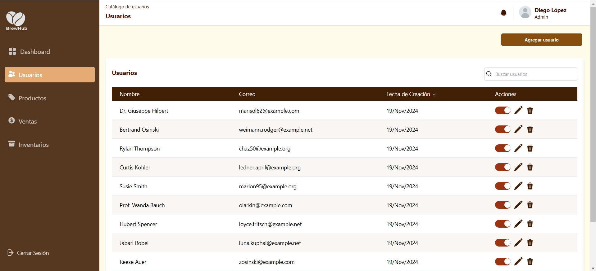

# BrewHub Monorepo

Este es el monorepo para **BrewHub**, parte de una prueba práctica desarrollado en **PHP + Laravel** y un front-end en **ReactJS + Tailwind CSS**.

---

## Requisitos

### Back-end

Para el servidor, trabajé con:

- **PHP** v8.2.x o superior
- **Composer** 2.6.x o superior
- **MySQL**
- **Laravel** 11.x.x o superior

### Front-end

En el cliente, utilicé:

- **Node.js** v20 o superior
- **npm** v10 o superior

---

## Instalación

Cada subproyecto tiene su propio archivo README con las instrucciones de instalación específicas. Aquí están los enlaces directos para que puedas seguirlas fácilmente:

- [Guía de instalación del back-end](./brewhub-backend/README.md)
- [Guía de instalación del front-end](./brewhub-frontend/README.md)

> [!NOTE]  
> El usuario creado por defecto tiene el correo `test@mail.com` y contraseña `password`.

---

## Sobre el proyecto

### Decisiones técnicas

Para este proyecto, opté por construir una **API basada en sesiones**, utilizando las herramientas nativas de Laravel para manejar autenticación y seguridad. Implementé el sistema de login con **Laravel Breeze**, que me permitió tener una base sólida para autenticar usuarios y manejar sesiones de forma eficiente. Además, utilicé las convenciones RESTful para estructurar las rutas de la API, manteniendo claridad y escalabilidad.

En el front-end, decidí usar **Vite** como empaquetador, principalmente por su velocidad en el desarrollo, combinado con **React Router DOM** para la navegación entre vistas como el formulario de login y la lista de usuarios.

Un reto interesante fue el manejo de **CORS** en Laravel 11, dado que el uso de cookies y sesiones requiere configuraciones muy específicas. Tras varias iteraciones y pruebas, logré configurar correctamente los middleware para asegurar la comunicación segura entre el cliente y el servidor.

---

### Arquitectura de componentes: Atomic Design

A la hora de organizar los componentes del front-end, seguí la metodología **Atomic Design**, que me permite desarrollar de manera más modular y escalable. Suelo usar la recomendación de **Vir Gonzalez** de su blog de Medium titulado "[Todo lo que tienes que saber sobre Atomic Design](https://medium.com/@virpalmieri1/todo-lo-que-tienes-que-saber-sobre-atomic-design-8ef1a8f35f06)" como punto de partida.

Así fue como estructuré los componentes:

- **Átomos**: Componentes más básicos, como botones o inputs, diseñados con estilos consistentes para ser reutilizables.
- **Moléculas**: Combinaciones simples de átomos, como un botón con un ícono.
- **Organismos**: Partes funcionales completas, como formularios o barras de navegación.
- **Plantillas**: Estructuras que organizan a los organismos, definiendo cómo se ven y se disponen en las vistas.
- **Páginas**: Administran el acceso y la lógica de enrutamiento, sirviendo como punto de entrada para cada recurso.
- **Compartidos**: Una categoría adicional que utilizo para almacenar contextos, hooks personalizados y configuraciones globales del proyecto.

---

### Retos enfrentados y soluciones

El mayor reto técnico fue trabajar con la gestión de CORS en Laravel 11. Este aspecto me sacó de mi zona de confort, ya que al ser una API basada en sesiones, la configuración de cookies seguras y políticas de origen requería atención especial. La solución fue ajustar los middleware y realizar pruebas exhaustivas en diferentes escenarios.

---

### Seguridad en el sistema de login

Aquí implementé las siguientes medidas:

- **Tokens CSRF**: Para asegurar que las solicitudes sean legítimas.
- **Sesiones seguras**: Basadas en cookies para evitar accesos indebidos y garantizar su uso únicamente en entornos HTTPS.
- **Revocación de tokens**: Las sesiones permiten invalidar credenciales comprometidas de manera sencilla desde el servidor.
